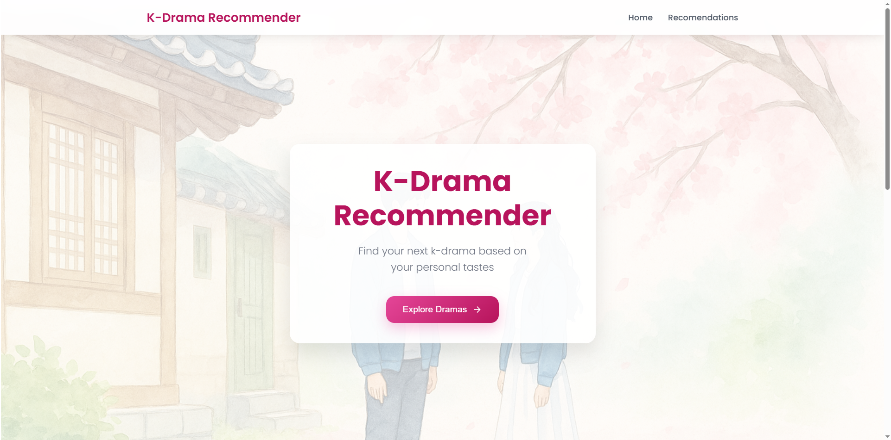
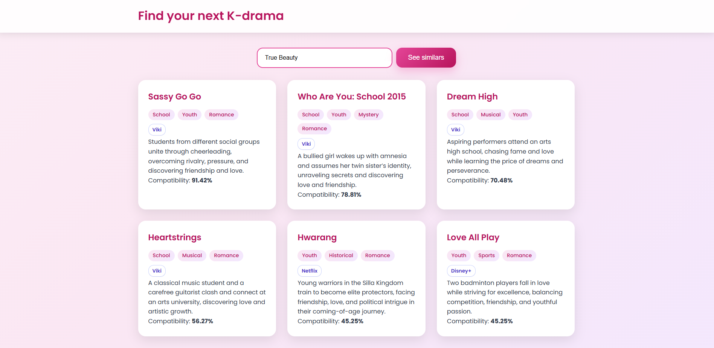

# K-Drama Recommender

K-drama recommendation app powered by TF-IDF + cosine similarity (Flask backend) and a simple HTML/CSS/JS frontend.
The dataset (`kdramas.csv`) was curated for **Brazilian** streaming availability.

### Landing Page



### Search Page



---

## Table of Contents

- [About](#about)
- [Motivation](#motivation)
- [Features](#features)
- [Architecture](#architecture)
- [Prerequisites](#prerequisites)
- [Installation](#installation)
- [Usage](#usage)
- [API](#api)
- [Data Schema](#data-schema)
- [Configuration](#configuration)
- [Customization](#customization)
- [Troubleshooting](#troubleshooting)
- [Roadmap](#roadmap)
- [Contributing](#contributing)
- [Maintainer](#maintainer)
- [License](#license)
- [Project Status](#project-status)
- [Acknowledgments](#acknowledgments)

## About

This project returns K-drama recommendations based on similarity between a user-selected title and other titles. Similarity is computed from the combined **Genres** and **Styles** text using TF-IDF vectorization and cosine similarity (scikit-learn). The frontend renders results as cards with genre tags and “platform chips” (e.g., Netflix, Viki), all driven by a CSV dataset.

## Motivation

I’m **Priscilla Leandro**, a Software Engineering student (2nd semester). I’ve studied HTML/CSS/JS since early 2025 and recently started Python and machine learning. To practice, I build a small ML project every weekend. After seeing a “movie recommender” idea, I adapted it to **K-dramas**—a personal interest. I often spend more time searching than watching, and I wanted an easy way to find similar shows I’ll likely enjoy.

The CSV was built entirely by me. For the **Brazil** context, I researched where each title is available and aimed for a user-friendly presentation. The app is easy to adapt to larger catalogs or other contexts (Western series, films, broader Asian dramas, telenovelas). The landing image and color palette are intentionally simple to re-skin.

## Features

- Similarity search using `Genres + Styles` (TF-IDF + cosine similarity).
- Clean, responsive UI (cards, tags, platform chips, sticky navbar).
- CSV-driven data model; no database required.
- CORS-enabled API for local development.
- Optional server-side filtering/prioritization by platform.

## Architecture

```
.
├─ app.py                 # Flask API: TF-IDF model + /recommend
├─ kdramas.csv            # Dataset (Brazil availability)
├─ requirements.txt
├─ static/
│  ├─ index.html          # Landing + search + results grid
│  ├─ styles.css          # Layout, tags, chips, responsive rules
│  └─ script.js           # Autocomplete + fetch + rendering
└─ screenshots/           # Optional images used in this README
```

- **Backend:** Python, Flask, Flask-CORS, pandas, scikit-learn
- **Frontend:** HTML, CSS, JavaScript (no framework)

## Prerequisites

- Python 3.10+
- pip
- (Optional) A static file server (or open `static/index.html` directly)

## Installation

1. **Create and activate a virtualenv; install deps**

```bash
python -m venv .venv
# Windows
.venv\Scripts\activate
# macOS/Linux
source .venv/bin/activate

pip install -r requirements.txt
```

2. **Run the API**

```bash
python app.py
# default: http://127.0.0.1:5000
```

3. **Open the frontend**

- Open `static/index.html` in your browser, **or** serve the folder:

````bash
# Option A (Python)
cd static
python -m http.server 5500

If you serve on a different origin/port, update the fetch URL in `static/script.js`.

## Usage

1. In the input box, type a title from the CSV (autocomplete helps).
2. Click **See similars**.
3. Review the cards: genres, styles, platform chip(s), description, and similarity.

## API

### `GET /recommend`

Returns recommended K-dramas similar to a given title.

**Query parameters**

| Param           | Type   | Required | Default | Description                                                                   |                                                  |
| --------------- | ------ | -------- | ------- | ----------------------------------------------------------------------------- | ------------------------------------------------ |
| `title`         | string | yes      | —       | Case-insensitive title that exists in the CSV.                                |                                                  |
| `limit`         | int    | no       | `5`     | Number of recommendations to return.                                          |                                                  |
| `platform`      | string | no       | —       | Comma-separated filters, e.g. `netflix,viki`. Matching items are prioritized. |                                                  |
| `only_platform` | \`0    | 1\`      | no      | `0`                                                                           | If `1`, return only items that match `platform`. |

**Response (example)**

```json
{
  "input": "Business Proposal",
  "input_platform": "Viki",
  "input_description": "A young woman goes on a blind date...",
  "recommendations": [
    {
      "title": "What's Wrong with Secretary Kim",
      "genres": "Romance, Comedy",
      "styles": "Office, Corporate",
      "platform": "Viki",
      "description": "A narcissistic CEO...",
      "similarity": 93.78
    }
  ]
}
````

**Curl example**

```bash
curl "http://127.0.0.1:5000/recommend?title=Business%20Proposal&limit=5&platform=netflix,viki&only_platform=0"
```

## Data Schema

`kdramas.csv` must include the following columns:

| Column        | Description                                                         |                         |
| ------------- | ------------------------------------------------------------------- | ----------------------- |
| `Title`       | Canonical title used for lookup (must match the autocomplete list). |                         |
| `Genres`      | Comma-separated list; used for similarity.                          |                         |
| `Styles`      | Comma-separated list; used for similarity.                          |                         |
| `Platform`    | Streaming availability (Brazil focus). Use `,` or \`                | \` for multiple values. |
| `Description` | Short synopsis.                                                     |                         |

**Example row**

```csv
Title,Genres,Styles,Platform,Description
"Run On","Sports, Romance","Drama","Netflix","A national sprinter and a subtitle translator fall in love..."
```

If `Platform` is missing, the backend creates an empty column to avoid errors.

## Configuration

- **API base URL:** `static/script.js` contains the fetch to `http://127.0.0.1:5000/recommend`. Change this if you deploy the API elsewhere.
- **Autocomplete list:** `static/script.js` includes a `titles` array. Keep it in sync with `kdramas.csv` or replace it with a dedicated `/titles` endpoint later.

## Customization

- **Platform chips:** Styled via `.platform-chip` in `static/styles.css`.
- **Color theme / hero image:** Update CSS variables and the background image in `.landing-page` to re-skin quickly.
- **Filtering by platform (client):** Pass `?platform=netflix,viki` and optionally `&only_platform=1` in the request URL.

---

## Troubleshooting

- **CORS errors:** Flask-CORS is enabled. Confirm host (`127.0.0.1` vs `localhost`) and ports match.
- **404 “Title not found”:** The `title` must exist in `kdramas.csv`. Update the `titles` array for autocomplete.
- **Platforms not showing:** Ensure `Platform` is populated in the CSV (use `,` or `|` for multiples).
- **No results / low similarity:** Increase `limit`. Avoid `only_platform=1` if it over-filters.

---

## Roadmap

- Replace static autocomplete with `/titles`.
- Popularity and/or recency boosts (extra columns).
- Optional keyword search over `Description`.
- Deployment templates (Render/Fly/Heroku for API; Netlify/Vercel for UI).
- Expand catalog beyond K-dramas (other regions/genres).

---

## Contributing

1. Fork the repository.
2. Create a feature branch: `git checkout -b feat/my-feature`.
3. Commit with clear messages.
4. Open a pull request.

---

## Maintainer

**Priscilla Leandro** — Software Engineering student (2nd semester)
Focus areas: Data Science with Python and practical ML applications.
Other languages abilities: HTML, CSS, JavaScript

---

## License

MIT. See `LICENSE` for details.

---

## Project Status

Active learning project. Breaking changes may occur while iterating.

---

## Acknowledgments

- Dataset curation and Brazil-specific platform mapping by Priscilla Leandro.
- scikit-learn for vectorization and similarity primitives.
